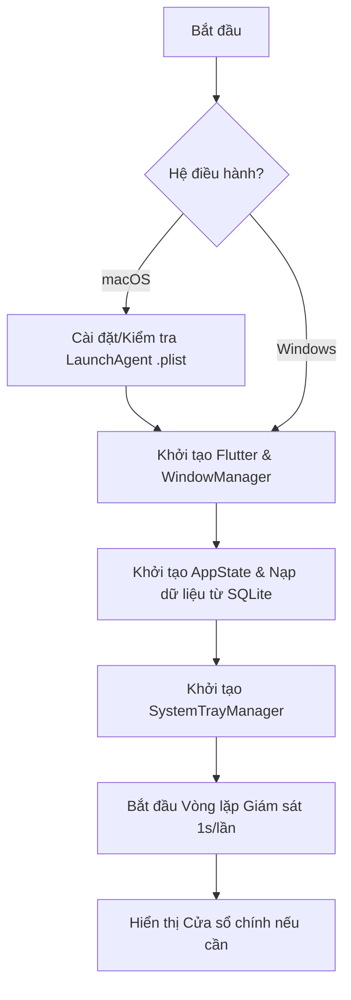
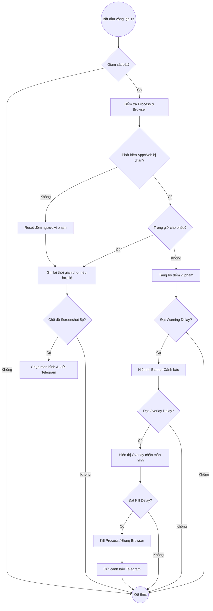
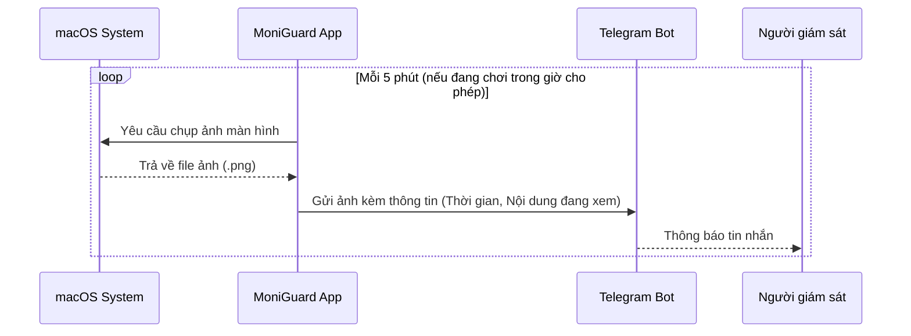

# Luồng Hoạt động của MoniGuard (Phiên bản macOS)

Tài liệu này mô tả chi tiết luồng hoạt động của ứng dụng MoniGuard, từ lúc khởi động cho đến các vòng lặp kiểm soát và tương tác người dùng.

## 1. Luồng Khởi động (Startup Flow)

Khi máy tính khởi động hoặc người dùng mở ứng dụng:

---

## 2. Vòng lặp Giám sát (Monitoring Loop)

Đây là quy trình cốt lõi chạy ngầm mỗi giây để kiểm soát việc sử dụng máy tính.

---

## 3. Chế độ macOS Screenshot (macOS Specific Flow)

Trên macOS, khi ứng dụng ở chế độ "Screenshot Mode", nó hoạt động như một công cụ giám sát từ xa thay vì chặn cứng.

---

## 4. Cấu trúc Dữ liệu & Lưu trữ

Ứng dụng sử dụng SQLite để lưu trữ cấu hình và lịch sử:

*   **Bảng `settings`**: Lưu Token Telegram, ChatID, mật khẩu app, các mốc thời gian delay, danh sách từ khóa và ứng dụng bị chặn.
*   **Bảng `logs`**: Lưu lịch sử chơi (Thời gian bắt đầu, Kết thúc, Tổng thời lượng, Tên ứng dụng/Web).
*   **Bảng `system_events`**: Lưu các sự kiện hệ thống (Khởi động, Lỗi, Cài đặt LaunchAgent).

---

## 5. Tương tác Người dùng (User Interaction)

*   **Tray Icon (Thanh trạng thái)**:
    *   Xem nhanh trạng thái giám sát và thời lượng sử dụng trong phiên hiện tại.
    *   Nút mở cửa sổ **Settings** hoặc **Thoát ứng dụng** (Yêu cầu mật khẩu nếu đã cài đặt).
*   **Cửa sổ Cấu hình (Settings Window)**:
    *   **Tab Giám sát (Monitoring)**: Thiết lập lịch trình cho phép/chặn (Schedule) theo tuần.
    *   **Tab Thống kê (Statistics)**: Biểu đồ thời gian sử dụng thực tế.
    *   **Tab Lịch sử (History)**: Danh sách chi tiết các phiên truy cập Web/App bị hạn chế.
    *   **Tab Cài đặt (Settings)**: Cấu hình Telegram Bot, mốc thời gian cảnh báo (Delays), mật khẩu và danh sách từ khóa.
